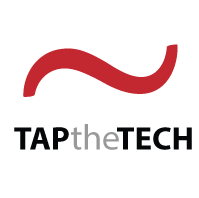

I am currently pursuing Master of Science in Computer Science degree at [Northeastern University, Khoury College of Computer Sciences](https://www.khoury.northeastern.edu){:target="\_blank"}, Boston MA.

I received my Bachelors in Technology (B.Tech) in Computer Engineering from [K.J. Somaiya College Of Engineering](https://kjsce.somaiya.edu){:target="\_blank"} and worked as a Software Developer at [Barclays](https://home.barclays){:target="\_blank"} for three years. 

My main interests include:
- Software development (Backend APIs, applications, microservices, etc.)
- Systems programming (Operating systems, kernels, etc.)
- Tools development (Compilers, debuggers, etc.)

My goal is to develop performant, easy-to-use tools that leverage the immense potential offered by modern hardware, making overall computing experience much smoother and bloat free for users and developers.

Other than programming, I also like drawing art and playing video games.

 

# Education

-----

#### **Northeastern University**
<strong>M.S. in Computer Science</strong> 
<i>Boston, MA</i>&nbsp;&nbsp;|&nbsp;&nbsp;<i>Sept 2022 - May 2024 (Expected)</i> 

-----
<strong>GPA:</strong> 4/4   
<strong>Coursework:</strong> Operating Systems <b><i>(Received Rockstar Programmer Award)</i></b>, Program Design Paradigms, Database Management Systems 

-----

#### **K.J. Somaiya College of Engineering**
<strong>B.Tech in Computer Engineering</strong> 
<i>Mumbai, India</i>&nbsp;&nbsp;|&nbsp;&nbsp;<i>Aug 2015 - May 2019</i>

-----
<strong>CGPA:</strong> 8.56/10   
<strong>Coursework:</strong> Computer Architecture, Operating Systems, Systems Programming and Compiler Construction, Fundamentals of Programming, Data Structures, Algorithms 

 
# Experience
-----

#### **Hewlett Packard Enterprise**
<strong>Systems Software Engineer Intern</strong> 
<i>Andover, Massachusetts</i>&nbsp;&nbsp;|&nbsp;&nbsp;<i>May 2023 - Dec 2023</i>

----- 
- Built NVGrid, a foundational library suite for developing advanced cloud storage apps leveraging NVMe, RDMA
- Implemented RDMA channel API using IBVerbs to provide high-speed data transfers with minimum latency
- Developed TCP channel for non-RDMA NICs, and Shared Memory channel for services on the same node
- Engineered Connection Manager library for establishing channel connections between nodes; used gRPC service framework and Redis for service look-up; and Boost state machine for connection orchestration
- Architected Telemetry library to monitor the health and performance metrics of NVGrid components and integrated it with Grafana for visualization
- Tech used: C/C++, IBVerbs, Boost, gRPC, Redis, Kubernetes, Docker, Grafana, Bazel, GoogleTest, Jenkins

-----

#### **Northeastern University**
<strong>Research Assistant</strong> 
<i>Boston, Massachusetts</i>&nbsp;&nbsp;|&nbsp;&nbsp;<i>Jan 2023 - May 2023</i>

----- 
- Provided SME support for Discovery Cluster on topics ranging from Linux, Slurm, Docker, MPI, Cuda, and Distributed ML Training
- Orchestrated concourse pipelines to build and deploy containers of docker and Singularity
- Collaborated with researchers to construct and launch large ML models on multi-GPU clusters, leveraging PyTorch and TensorFlow

-----

#### **Barclays**
<strong>Software Developer</strong> 
<i>Pune, India</i>&nbsp;&nbsp;|&nbsp;&nbsp;<i>Jul 2019 - Jul 2022</i>

----- 
● <strong>Barclays Mobile Banking APIs</strong> 
○ Designed and developed an ecosystem of APIs for setting up repayment plans for delinquent accounts. 
○ Gained 5x improvement in API response times by making downstream API calls asynchronous and parallel. 
○ Implemented a performance logging and monitoring library to track performance of these APIs. 
● <strong>Customer Outcome Testing Application</strong> 
○ Gathered requirements from bank agents to understand how they manually reviewed collection cases. 
○ Developed a backend API and database components to digitize the manual case review process. 
○ Closely worked with bank agents to build UI and iterate over the application flow. 
○ <strong><i>Key Achievements</i></strong>: Reduced manual effort for case reviews by 232 hours/week (5.8 FTEs). 
● <strong>AWS Microservices and Cloud Infrastructure Automation</strong> 
○ Developed microservices to create collection cases for delinquent accounts received via Apache Kafka events. 
○ Created CloudFormation templates to deploy auto-scaling ECS clusters, MSK clusters, RDS, and EC2 machines on the AWS cloud platform. 
○ Implemented AWS Lambdas for rotating credentials and replicating EBS volumes to backup data. 
○ Developed features for APIs to automatically fetch the latest credentials from AWS Secret Manager. 
○ <strong><i>Key Achievements</i></strong>: Single-click infra provisioning; Reduced server costs by demand-based cluster scaling. 

-----

#### **Accelo Innovations**
<strong>Computer Vision Developer</strong> 
<i>Mumbai, India</i>&nbsp;&nbsp;|&nbsp;&nbsp;<i>Aug 2017 - Oct 2017</i>

-----
- Developed <strong>depth mapping module (using stereo-vision)</strong> in <strong>Python</strong> and <strong>C</strong> using a two camera setup.
- Integrated <strong>Tensorflow's object detection</strong> with the depth mapping module to identify objects and calculate their distance from the vehicle.

-----

#### **Truckerrs**
<strong>Frontend Developer</strong> 
<i>Mumbai, India</i>&nbsp;&nbsp;|&nbsp;&nbsp;<i>May 2016 - Jun 2016</i>

-----
- Designed the <strong>UI/UX</strong> for the website.
- Implemented the <strong>front-end</strong> of the booking system and integrated it with the <strong>back-end API</strong>.
- Used <strong>Google Maps API</strong> for features such as tracing the path of the vehicle on map.

-----

#### **TapTheTech**
<strong>Flash Animator</strong> 
<i>Mumbai, India</i>&nbsp;&nbsp;|&nbsp;&nbsp;<i>Mar 2013 - Jan 2014</i>

-----
- TapTheTech was a group of students who believed <strong>MOOCs are the future of education</strong>. It went on to become one of the <strong>official learning hubs on Coursera</strong>
- I was one of the <strong>core team members</strong> and <strong>created content, animations</strong> for the educational videos on the <strong>[YouTube channel](https://www.youtube.com/user/TAPtheTECH){:target="\_blank"}</strong>; helped <strong>organize events</strong> in schools to spread awareness about MOOCs
