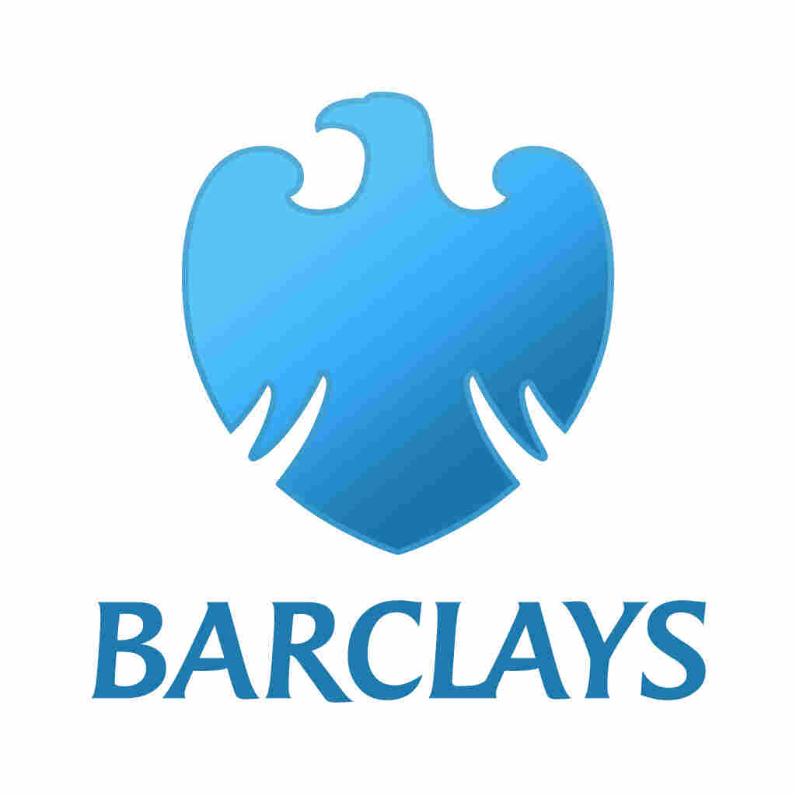

I received my Bachelors in Technology (B.Tech) in Computer Engineering from [K.J. Somaiya College Of Engineering](https://kjsce.somaiya.edu){:target="\_blank"} and currently working as a Software Developer at [Barclays](https://home.barclays){:target="\_blank"}. 

My main interests include:
- Tools development (Compilers, debuggers, etc.)
- Systems programming (Operating systems, kernels, etc.)
- Graphics programming 
- Game engines

My goal is to develop performant, non over-engineered tools that leverage the immense potential offered my modern hardware, making overall computing experience much smoother and bloat free for users and developers.

Other than programming, I also like drawing art and playing video games.

 

# Education

-----

#### **B.Tech in Computer Engineering, K.J Somaiya College of Engineering**
2015 - 2019 

-----
I did my Bachelor of Technology in Computer Engineering from K.J Somaiya College of Engineering. 
 
<strong>CGPA:</strong> 8.56/10   
<strong>Relevant coursework:</strong> Computer Architecture, Operating Systems, Systems Programming and Compiler Construction, Fundamentals of Programming, Data Structures, Algorithms 

 
# Experience
-----

#### **Barclays, Pune: Software Developer**
July 2019 - Present

----- 
- Developed tools for bank employees which help them analyze customer experience with certain bank processes, generate reports and statistics related to quality assurance and <strong>digitize</strong> this entire process which previously required manual efforts.
- Replaced legacy applications with modern tech stack running on <strong>AWS</strong> to improve performance, reduce license costs and tech debt.
- Developed tooling to automate provisioning of AWS resources like <strong>EC2 machines, RDS (Relational Databases), Kafka clusters</strong>, etc. to provide a highly available platform.
- Developed a dashboard for the control team to monitor the health of and reconcile errors on <strong>Kafka cluster and applications</strong>.

-----

#### **Accelo Innovations, Mumbai: Computer Vision Developer**
August 2017 to October 2017

-----
- Developed <strong>depth mapping module (using stereo-vision)</strong> in <strong>Python</strong> and <strong>C</strong> using a two camera setup.
- Integrated <strong>Tensorflow's object detection</strong> with the depth mapping module to identify objects and calculate their distance from the vehicle.

-----

#### **Truckerrs, Mumbai: Frontend Developer**
May 2016 to June 2016

-----
- Designed the <strong>UI/UX</strong> for the website.
- Implemented the <strong>front-end</strong> of the booking system and integrated it with the <strong>back-end API</strong>.
- Used <strong>Google Maps API</strong> for features such as tracing the path of the vehicle on map.

-----

#### **TapTheTech, Mumbai: Flash Animator**
March 2013 to January 2014

-----
- TapTheTech was a group of students who believed <strong>MOOCs are the future of education</strong>. It went on to become one of the <strong>official learning hubs on Coursera</strong>
- I was one of the <strong>core team members</strong> and <strong>created content, animations</strong> for the educational videos on the <strong>[YouTube channel](https://www.youtube.com/user/TAPtheTECH){:target="\_blank"}</strong>; helped <strong>organize events</strong> in schools to spread awareness about MOOCs